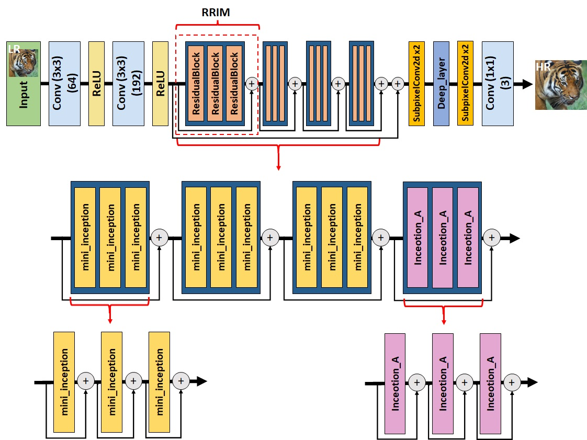

# 利用人工智慧提升圖片解析度
## ours_srgan 生成器架構

## Website
### 架構


### 目錄結構
```
website/
    └── media
          ├── image
          └── output
    └── sr_image
          ├── migrations
          └── OURS_SRGAN
          	└── models
          	      └── g.npz
          	├── __init__.py
          	├── evaluate.py
		└── ours_srgan.py
          └── templates
          	└── index.html
          ├── __init__.py
          ├── apps.py
          ├── form.py
          ├── models.py
          ├── urls.py
          └── views.py
    └── SRGAN_BASE_GAN
          ├── __init__.py
          ├── asgi.py
          ├── settings.py
          ├── urls.py
          ├── views.py
          └── wsgi.py
    └── static
          └── css
          	└── slideshow.css
          	└── style.css
          └── imgaes
          	└── github.png
          	└── logo.png
          	└── Tunnel.mp4
          └── js
          	└── slideshow.js
    └── templates
          ├── base.html
          └── ref.html
    └── db.sqlite3
    └── manage.py
    
